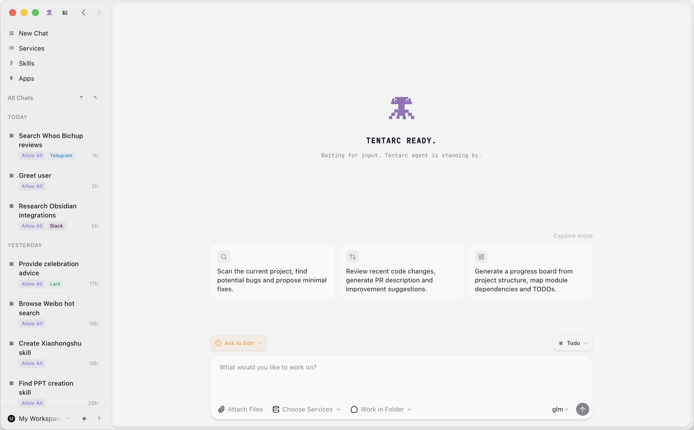
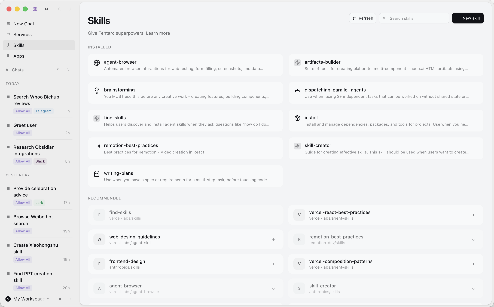
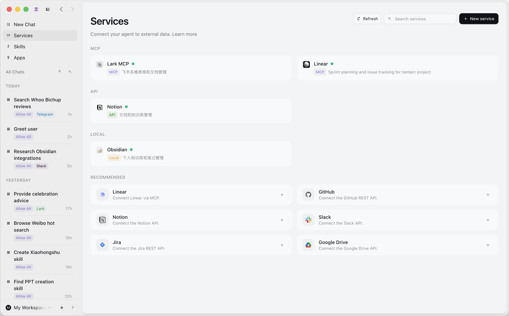
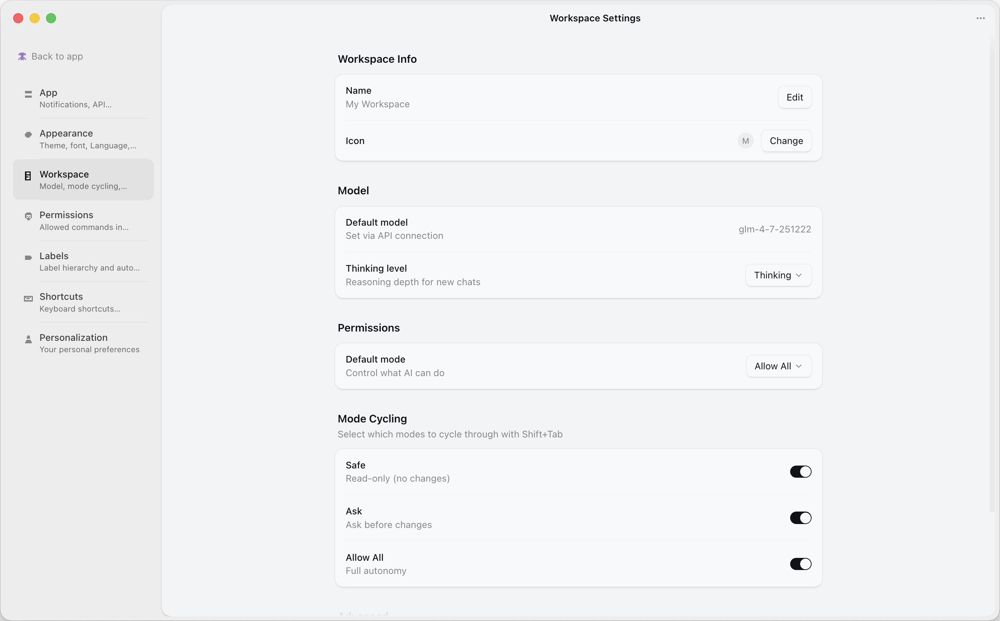
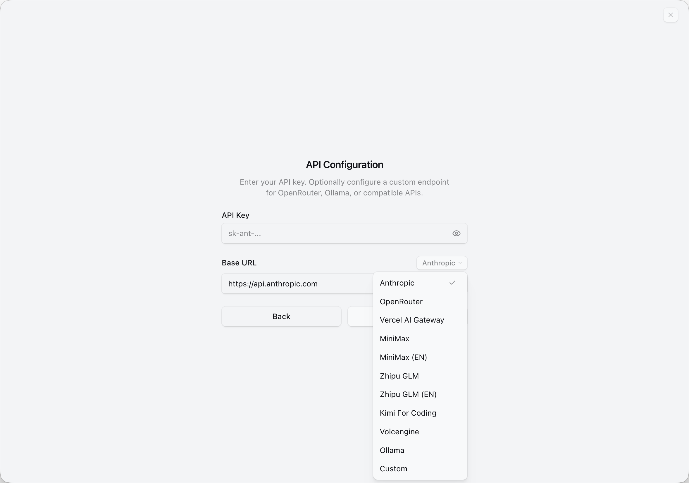

  

<h1 align="center">Tentarc</h1>

  <strong>The Agent-Native Desktop App</strong> 
  One agent. Every app. Runs locally.

  <a href="https://tentarc.com">Website</a> ·
  <a href="#install">Install</a> ·
  <a href="#features">Features</a> ·
  <a href="#quick-start">Quick Start</a> ·
  <a href="https://tentarc.com/en/changelog">Changelog</a> ·
  <a href="ROADMAP.md">Roadmap</a> ·
  <a href="README_CN.md">中文</a>

  
  
  

---

  

---

## What is Tentarc?

Tentarc connects your apps, APIs, and data into a single fluid interface. Experience agent-native multitasking with the power of Claude Code.

Send a message from Lark, Slack, Telegram, or Discord — your agent executes locally and sends the result back. No config files. No setup wizards. You describe what you want, and the agent figures out how.

> Think of it as Claude Code — but for everything on your desktop, not just code.

## Things that just work

**"Connect to Linear / Gmail / Slack..."**
Tell the agent "add Linear." It finds the right API, reads the docs, sets up credentials, and configures everything automatically.

**"I have an MCP config."**
Paste it. The agent handles the rest.

**"What about local tools?"**
Fully supported. Point it at an npx command, a Python script, or any local binary.

**"Can it handle custom APIs?"**
Paste an OpenAPI spec, endpoint URLs, screenshots of docs — whatever you have. It figures it out.

**"How do I create a new skill?"**
Describe what the skill should do, give it context. The agent takes care of the rest.

**"Do I need to restart after changes?"**
No. Everything is instant. Mention new skills or services with `@`, even mid-conversation.

## Install

| Platform | Download |
|----------|----------|
| macOS (Apple Silicon, Stable) | [Tentarc-arm64.dmg](https://download.tentarc.com/releases/latest/Tentarc-arm64.dmg) |
| macOS (Intel, Stable) | [Tentarc-x64.dmg](https://download.tentarc.com/releases/latest/Tentarc-x64.dmg) |
| Windows (Stable) | [Tentarc-x64.exe](https://download.tentarc.com/releases/latest/Tentarc-x64.exe) |
| Linux (Stable) | [Tentarc-x64.AppImage](https://download.tentarc.com/releases/latest/Tentarc-x64.AppImage) |

Or visit [tentarc.com/download](https://tentarc.com/download) for more options.

## Features

### Apps — Your Messages, One Agent

Connect all your messaging platforms and let the agent handle conversations across **Lark, Telegram, Slack, and Discord** — with WeChat and iMessage coming soon.

Send a message from your phone, the agent executes on your machine, and the result comes back to you. Your agent is always reachable, no matter where you are.

### Services — Connect Your Data

One-click integrations with Linear, GitHub, Notion, Slack, Jira, Google Drive, Gmail, Calendar, Outlook, Teams, OneDrive, Obsidian — and more.

No manual config needed. Tell the agent what to connect, and it handles authentication and setup.

### Skills — Extend with Skills

Browse, install, and create skills that give your agent new superpowers — from browser automation and PDF handling to frontend design and code generation.

Create a skill by describing what you want, import existing ones, or share them across workspaces.

### Multi-Session Inbox

Not a single chat — a full inbox with workflow states:

**Todo → In Progress → Needs Review → Done**

Flag important sessions, archive old ones, AI-generated titles, full history saved to disk.

### Permission Modes

| Mode | Behavior |
|------|----------|
| **Explore** | Read-only. Agent can look but not touch. |
| **Ask to Edit** | Prompts for your approval before writes. (Default) |
| **Auto** | Full autopilot. Agent executes everything. |

Cycle with **SHIFT+TAB** during any conversation.

### Custom Model Providers

Anthropic, OpenRouter, Vercel AI Gateway, MiniMax, Zhipu GLM, Kimi, Volcengine, Ollama, or any custom endpoint. One config, every provider.

### And more...

- **Streaming responses** with real-time progress
- **Diff viewer** — review all file changes before accepting
- **File attachments** — drag-drop images, PDFs, Office docs
- **Background tasks** — long-running operations with progress tracking
- **Themes** — 15+ built-in themes, customizable per workspace
- **Auto-update** — always on the latest version

## Screenshots

<table>
  <tr>
    <td></td>
    <td></td>
  </tr>
  <tr>
    <td align="center">Skills</td>
    <td align="center">Services</td>
  </tr>
  <tr>
    <td></td>
    <td></td>
  </tr>
  <tr>
    <td align="center">Workspace Settings</td>
    <td align="center">API Configuration</td>
  </tr>
</table>

## Quick Start

1. **Install** — Grab the installer above or from [tentarc.com](https://tentarc.com/download)
2. **Connect** — Use Anthropic, OpenRouter, Ollama, or any compatible API endpoint
3. **Add services** — Say "add Gmail" and follow the prompts
4. **Work** — Create sessions, add skills, connect more services as you go

## Roadmap

See [ROADMAP.md](ROADMAP.md) for details.

- [x] Multi-session inbox with workflow states
- [x] Apps — Lark, Telegram, Slack, Discord
- [x] Services — Linear, GitHub, Notion, Google, Slack, Microsoft, and more
- [x] Skills system
- [x] Custom model providers (Anthropic, OpenRouter, Ollama, and more)
- [x] Permission modes (Explore / Ask / Auto)
- [x] Themes
- [ ] **Scheduled tasks** ← in progress
- [ ] **Long-term memory** ← in progress
- [ ] **Skills / Services / Apps refinements** ← in progress
- [ ] Automation workflows
- [ ] Mobile companion app

## Community

- [Report a Bug](https://github.com/tentarcai/tentarc-agent/issues)
- [Request a Feature](https://github.com/tentarcai/tentarc-agent/issues)
- [Discussions](https://github.com/tentarcai/tentarc-agent/discussions)
- [Discord](https://discord.gg/xbaJPBz4F)
- [Follow on X](https://x.com/tentarcai)

## Repository Scope

This repository is the public marketing homepage for Tentarc (docs, screenshots, launch information).

The production codebase is maintained separately and is closed-source.

## License

[CC BY 4.0](LICENSE)

---

  <a href="https://tentarc.com">tentarc.com</a>

